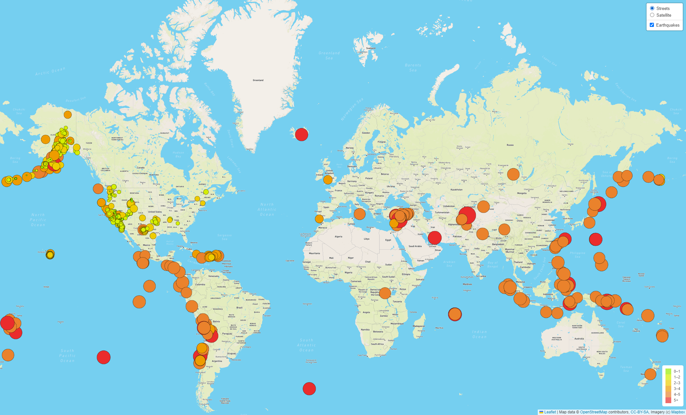
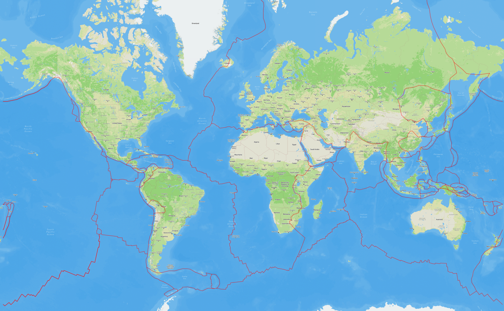
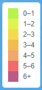
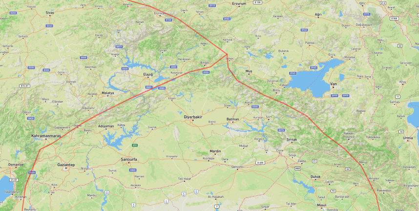
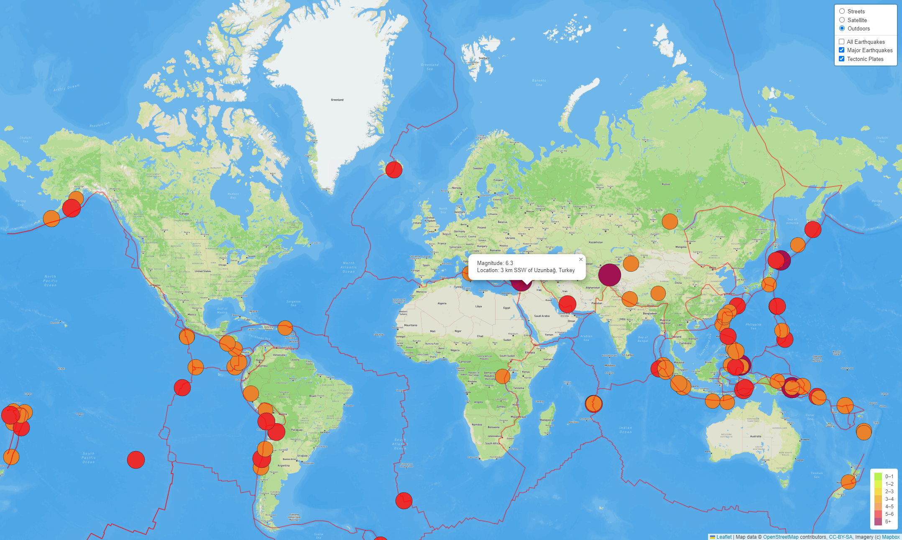

# Mapping Earthquakes with JavaScript and APIs

## Introduction to Earthquake Mapping
In this module, we used the Leaflet JavaScript API to populate a world map with GeoJSON earthquake data from the last 7 days. Each earthquake is marked with a circle whose radius and color are determined by the magnitude of the earthquake. Additionally, each earthquake will show a popup that displays its magnitude and location when clicked.

An image of the original map created during the module lessons can be seen here: 

In this challenge assignment, we added some more features to this map according to the deliverables below.

- **Deliverable 1: Add Tectonic Plate Data**.
- **Deliverable 2: Add Major Earthquake Data**.
- **Deliverable 3: Add an Additional Map**.

Challenge folder can be found here: [https://github.com/SeanWoodPhD/mapping-earthquakes/tree/main/Earthquake_Challenge](https://github.com/SeanWoodPhD/mapping-earthquakes/tree/main/Earthquake_Challenge)

## Resources
- USGS Earthquake Data: [all_week.geojson](https://earthquake.usgs.gov/earthquakes/feed/v1.0/summary/all_week.geojson)
- HTML: [index.html](Earthquake_Challenge/index.html)
- CSS: [style.css](Earthquake_Challenge/static/css/style.css)
- JavaScript: [challenge_logic.js](Earthquake_Challenge/static/js/challenge_logic.js)
- Tectonic Plate Data: [PB2002_boundaries.json](https://github.com/fraxen/tectonicplates/blob/master/GeoJSON/PB2002_boundaries.json)
- USGS Major Earthquake Data: [4.5_week.geojson](https://earthquake.usgs.gov/earthquakes/feed/v1.0/summary/4.5_week.geojson)

## Deliverable 1: Add Tectonic Plate Data
Tectonic plate data (referenced in Resources) was added to the map as a thick red line.

## Deliverable 2: Add Major Earthquake Data
Major earthquakes with a magnitude greater than 4.5 were added to the map as a separate toggleable layer, and an additional increment was added to the legend in purple.

## Deliverable 3: Add an Additional Map
The "Outdoors" map type was added as an additional option. This map type shows geographical features.

## Final Map
The finalized map can be seen below with the "Tectonic Plates" and "Major Earthquakes" layers toggled on, and the "All Earthquakes" layer toggled off. The map is a stunning real-world visualization of the fact that earthquakes typically occur at tectonic plate boundaries. With the help of the Outdoors map layer, it can also be seen that these boundaries often result in mountainous regions.

